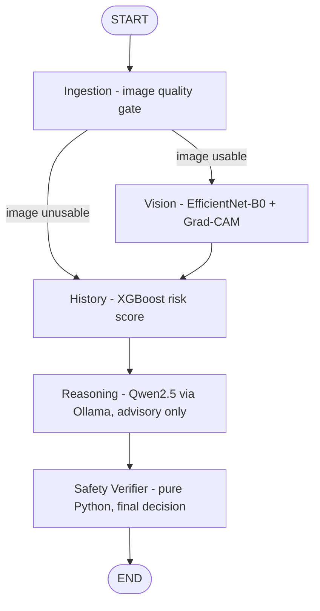

# SkinSight

Multi-agent skin-lesion **triage support** for community health workers,
ASHA workers, and primary-health-centre staff. Takes one lesion photograph
plus an eight-field patient history and returns a **triage urgency
recommendation** — how soon professional assessment should happen.

> **This is not a diagnosis. Only a doctor can tell you what it is.**

## What SkinSight is — and is not

| It is | It is not |
| --- | --- |
| A triage-support prototype | A diagnostic system |
| A hackathon/research project | A medical device |
| Deterministic safety escalation over ML signals | Clinically validated software |
| A tool that says *how soon* to seek care | A tool that names a disease |

Every failure mode routes the patient **toward** professional assessment,
never away from it.

## Core design principle

> **The LLM explains. Deterministic rules decide.**

The language model produces ABCDE-style supporting text and an *advisory*
urgency suggestion. It has no authority over the final decision and never
writes the actionable instruction. A pure-Python safety verifier — no model
calls, no network — owns the final band and instruction, and its rules can
**only escalate** urgency.

> Classical CV validates. A CNN classifies. Gradient boosting handles
> history and survives offline. The LLM explains — but never decides and
> never instructs. Pure Python decides, and it can only ever escalate.

## Output bands

| Band | Meaning | Action | Timeframe |
| --- | --- | --- | --- |
| 🔴 `URGENT` | Red flags or strong concerning signal | District hospital / dermatologist referral | Within 72 hours |
| 🟠 `REVIEW` | Professional examination warranted | Clinic or teledermatology review | 2–4 weeks |
| 🟡 `MONITOR` | Low concern | Re-photograph and reassess | 3 months |
| ⚪ `INCONCLUSIVE` | Reliable assessment not possible | Refer to clinician regardless | 2–4 weeks |

## Architecture — five LangGraph agents



1. **Ingestion** — decodability, Laplacian blur and brightness checks,
   plus a conservative non-skin gate (grayscale/document detection,
   screenshot detection, and a brightness-independent skin-chroma
   presence check whose generous band is unit-tested to accept all six
   Fitzpatrick tones — a false rejection degrades to an answers-only
   assessment, never a blocked one). Makes a genuine graph-level routing
   decision (`add_conditional_edges`).
2. **Vision** — EfficientNet-B0 (timm) fine-tuned on HAM10000, seven
   classes, Grad-CAM heatmap. Missing weights degrade safely: no
   probabilities are ever fabricated.
3. **History** — XGBoost over the eight questionnaire fields; runs on CPU,
   offline. Falls back to a transparent labelled heuristic if weights are
   missing.
4. **Reasoning** — Qwen2.5-7B-Instruct via local Ollama, JSON-constrained
   and schema-validated. Any failure sets `reasoning = None`.
5. **Safety Verifier** — deterministic rules R1–R9
   ([backend/agents/safety.py](backend/agents/safety.py)); monotonic
   escalation only; owns the final band and the static instruction.

### Safety rules

| Rule | Condition | Effect |
| --- | --- | --- |
| `R1_BLEEDING` | bleeding | URGENT |
| `R2_RAPID_EVOLUTION` | changed recently and duration < 6 months | URGENT |
| `R3_NEW_LESION_OVER_50` | age > 50 and duration < 12 months | URGENT |
| `R4_FAMILY_HISTORY` | family history of melanoma + recent change | URGENT |
| `R5_MALIGNANT_SIGNAL` | malignant-group probability > 0.15 | at least REVIEW |
| `R6_HIGH_MALIGNANT_SIGNAL` | malignant-group probability > 0.40 | URGENT |
| `R7_NO_USABLE_INPUT` | no usable image and no history (defensive) | INCONCLUSIVE |
| `R8_LLM_FAILED` | reasoning unavailable | at least INCONCLUSIVE |
| `R9_LOW_CONFIDENCE` | vision confidence < 0.35 | at least INCONCLUSIVE |

All applicable rules are evaluated and recorded — evaluation never stops at
the first trigger, and no rule can lower urgency.

**Degraded reasoning behaviour (deliberate decision):** the graph always
runs `History → Reason → Safety`. If Ollama is unavailable the reasoning
node returns `None`, `R8_LLM_FAILED` fires, and the final result is at
least `INCONCLUSIVE` (URGENT triggers still dominate). There is no more
permissive questionnaire-only path while R8 is active.

## Setup

Requirements: Python 3.11+, Node 18+, (optionally) an NVIDIA GPU and
[Ollama](https://ollama.com).

### 1. Python environment

```bash
python -m venv venv
# Windows: venv\Scripts\activate    Linux/macOS: source venv/bin/activate
```

Install PyTorch **first** with the CUDA build matching your GPU (RTX
5050-class Blackwell needs CUDA 12.8 wheels):

```bash
pip install torch torchvision --index-url https://download.pytorch.org/whl/cu128
```

Then the project packages:

```bash
pip install -r backend/requirements.txt
```

### 2. GPU verification (real matmul, not just a flag)

```bash
python scripts/verify_gpu.py
```

If versions clash, diagnose the wheel/driver combination rather than
forcing an old build. CPU-only operation still works (degraded, slower).

### 3. Ollama

```bash
ollama pull qwen2.5:7b-instruct
```

The model name is configurable via `DERMATRIAGE_OLLAMA_MODEL` (documented
fallback: `qwen2.5:3b-instruct`; never switched to silently — `/api/health`
reports the configured model). Roughly 5 GB VRAM quantized; EfficientNet
inference is much smaller, so both fit an 8 GB-class GPU. Do **not** train
EfficientNet while serving the 7B model on the same GPU — train elsewhere
(e.g. Colab) and copy the checkpoint in.

### 4. Backend

```bash
cd backend
uvicorn api:app --reload --host 0.0.0.0 --port 8000
```

Swagger UI: <http://localhost:8000/docs> · Health: `/api/health`

### 5. Frontend

```bash
cd frontend
npm install
npm run dev
```

Open <http://localhost:5173> (Vite proxies `/api` and `/static` to :8000).

### 6. Tests

```bash
pytest -v
```

Run from the repository root (`pytest.ini` sets the paths). The safety
suite alone: `pytest backend/tests/test_safety.py -v`.

## Web app pages and prototype accounts

The frontend is a full multi-page site: a landing page, the assessment
workspace (form beside the live agent pipeline on desktop), a per-user
assessment **history** with clickable case reviews, and **login/register**
pages. Accounts use salted PBKDF2 password hashes and random bearer tokens
in SQLite — reasonable prototype auth, but NOT presented as
production-grade identity management; demo use only, never real patient
data. Assessments run with or without an account; logging in simply saves
cases to your personal history.

## Datasets and model training

See [data/README.md](data/README.md) for dataset layout.

```bash
# Vision (run on a capable GPU environment, e.g. Colab; copy weights back)
python backend/models/train_vision.py --data-dir data/ham10000 --epochs 15

# History (CPU is fine; uses SYNTHETIC questionnaires — see the script header)
python backend/models/train_history.py --data-dir data/ham10000
```

Both split by `lesion_id` (never image index — HAM10000 has multiple
images per lesion), use seed 42, and headline malignant recall / balanced
accuracy, not overall accuracy. The history model's questionnaire fields
are **synthetically generated** conditioned on diagnosis labels — clearly
marked, reproducible, and *not* clinical validation.

## Offline behaviour

After dependencies + weights + Ollama models are installed locally, the
full pipeline needs no internet, no cloud inference, and no API key.

| Failure | Behaviour |
| --- | --- |
| Network disconnected (models local) | No functional change |
| Ollama down / bad JSON / timeout | `reasoning=None` → R8 → at least INCONCLUSIVE |
| Blurry/dark photo | Vision visibly skipped; case continues safely |
| Vision weights missing | Server stays up; health reports false; no fabricated probabilities |
| Any backend exception | Logged server-side; safe user-facing error; never a fabricated reassuring result |

## Demo walkthrough

Reproducible fixture questionnaires for all four beats live in
[demo/](demo/README.md); generate the synthetic demo images with
`python scripts/make_demo_images.py`.

1. **Standard case** — benign questionnaire + clear photo: watch all five
   agents complete in the live trace.
2. **Safety override** — set *bleeding = yes*: even if the LLM suggests
   REVIEW, safety forces **URGENT** with `R1_BLEEDING`, shown prominently
   ("The LLM explains. Deterministic rules decide.").
3. **Image rejection** — upload a blurred photo: the vision agent is
   visibly SKIPPED and the case still completes safely.
4. **Degraded mode** — stop Ollama (or set
   `DERMATRIAGE_SIMULATE_LLM_FAILURE=true`): R8 fires, the case fails safe.
5. **Test suite** — `pytest -v`: safety, routing, and API tests pass.

`DERMATRIAGE_DEMO_MODE=true` is reserved for reproducible fixtures only —
it never fakes metrics or masquerades stubs as trained-model output.
Pre-demo check: `python scripts/demo_healthcheck.py`. Cleanup of uploads /
heatmaps / case DB: `python scripts/cleanup_runtime.py`.

## Evaluation methodology

Run real evaluations — nothing is hand-typed:

```bash
python eval/metrics.py --data-dir data/ham10000           # metrics.json, confusion_matrix.png
python eval/bias_report.py --data-csv ... --image-dir ... --label-map ...   # bias_metrics.csv
```

Outputs land in `eval/out/` and are labelled with split provenance
(lesion-grouped test split, seed 42). If a checkpoint or dataset is
missing, the scripts print **"Not yet evaluated"** and exit — no
placeholder numbers, ever. Current status of this repository: **Not yet
evaluated** (no committed weights, no committed metrics).

## Fairness limitations

- HAM10000 under-represents darker skin tones; vision performance may
  degrade on darker skin.
- The deterministic history rules are image-independent, which mitigates —
  but does **not** eliminate — the vision model's fairness limitations.
  Nothing about the rule engine makes the system "unbiased".
- Per-Fitzpatrick results come only from genuinely running
  `eval/bias_report.py` with a documented label mapping.

## Domain-gap limitation (major)

HAM10000 is dermatoscopic imagery; SkinSight receives ordinary
smartphone photos. Benchmark performance does **not** transfer directly to
field smartphone photography.

## Privacy

Prototype only: no real patient data; public/synthetic demo images only;
no third-party cloud inference; no analytics SDKs; no secrets in the repo.
Uploads and Grad-CAM files live in `backend/runtime/` (git-ignored) and
can be wiped with `scripts/cleanup_runtime.py`. No HIPAA/GDPR/medical-
record compliance is claimed.

## Licensing

See [LICENSE_NOTES.md](LICENSE_NOTES.md) — notably HAM10000's
CC BY-NC-SA 4.0 non-commercial/share-alike restriction.

## Medical disclaimer

SkinSight is a hackathon research prototype for triage support. It is
not a medical device, is not clinically validated, must not be used for
autonomous diagnosis, and is not a substitute for professional medical
care. **This is not a diagnosis. Only a doctor can tell you what it is.**
